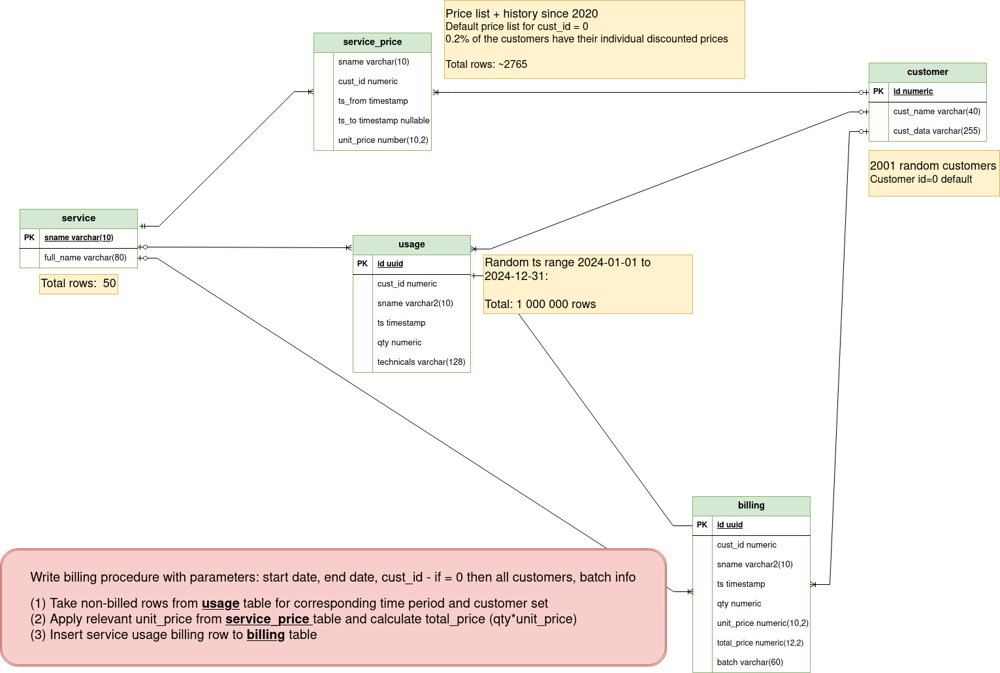

# Performance exercises

## Table of contents

- [1 Before we begin](#1-before-we-begin)
- [2 Exercise #1 - "simple" performance misbehavior](#2-exercise-1---simple-performance-misbehavior)
- [3 Exercise #2 - batch process exercise](#3-exercise-2---batch-process-exercise)

---

## (1) Before we begin

The scripts are intended to be run from `exercises/` directory. In the shell, please change the current directory to it.

Please make sure that the files have the appropriate permissions after unpacking or `git clone`:

```bash
cd exercises/
chmod 0600 *
chmod 0700 *.sh
```

As Postgres admin, please run script `00-setup.sql` to set up the `dev01` database and create the `u1` role:

```bash
psql -f 00-setup.sql
```

The configuration file `env-u1.sh` contains the connection information necessary to connect as `u1` to the `dev01` database. It assumes `PGHOST=127.0.0.1`. Please change it if your target Postgres server runs elsewhere.

Verify you can connect to the `dev01` Postgres database as `u1` by running:

```bash
./u1-psql.sh
```

[Back to Table of contents](#table-of-contents)

---

## (2) Exercise #1 - "simple" performance misbehavior

The intro story (based on a real case):

> You need to remediate a performance regression in production. Over time, a simple indexed query in the Java application has started taking longer than 4 seconds by default. The query is:
> 
> ```sql
> SELECT *
>   FROM s1.tst_bind_bigint
>  WHERE ext_id = ?;
> ```
>
> Table definition:

```sql
\d+ s1.tst_bind_bigint
                                       Table "s1.tst_bind_bigint"
 Column  |  Type   | Nullable | Storage  
---------+---------+----------+----------
 id      | bigint  | not null | plain    
 ext_id  | bigint  | not null | plain    
 info    | text    | not null | extended 

Indexes:
  "tst_bind_bigint_pk" PRIMARY KEY btree (id)
  "tst_bind_bigint_i1"         btree (ext_id)
``` 

What could go wrong?

### Step 1
Create the schema and load a small portion of the data, see: [01-create-schema.sql](01-create-schema.sql)

```bash
./01-create-schema.sh
```

[Back to Exercise #1](#2-exercise-1---simple-performance-misbehavior)

### Step 2
Review `TableAccess.java` (the Java test case - see: [TableAccess.java](TableAccess.java)) and run:

```bash
./02-app-behavior.sh
# this invokes: java TableAccess 12345
```

**Questions:**
- What is the execution time?
- Is this acceptable? If not, why?

[Back to Exercise #1](#2-exercise-1---simple-performance-misbehavior)

### Step 3
Compare with psql, see [03-query-psql.sql](03-query-psql.sql):

```bash
./03-query-psql.sh
## runs: SELECT * FROM s1.tst_bind_bigint WHERE ext_id = 12345;
```

**Question:** Any difference?

[Back to Exercise #1](#2-exercise-1---simple-performance-misbehavior)

### Step 4
Prime the cache with a different value and then test again - see: [04-query-psql.sql](04-query-psql.sql):

```bash
./04-query-psql.sh  
# uses ext_id = 44213
```

[Back to Exercise #1](#2-exercise-1---simple-performance-misbehavior)

### Step 5
Run the application for the same new key:

```bash
./05-app-behavior.sh  
# invokes: java TableAccess 44213
```

**Questions:**
- Any difference?
- What conclusions or hypotheses arise?

[Back to Exercise #1](#2-exercise-1---simple-performance-misbehavior)

### Step 6
Capture the execution plan - see [06-explain-analyze.sql](06-explain-analyze.sql):

```bash
./06-explain-analyze.sh
```

**Questions:**
- What plan is used?
- Does it use the index?

[Back to Exercise #1](#2-exercise-1---simple-performance-misbehavior)

### Step 7
Inspect `pg_stat_statements` for query stats - see [07-pg-stat-statements.sql](07-pg-stat-statements.sql):

```bash
./07-pg-stat-statements.sh
```

**Questions:**
- What stands out?
- Is the application’s query using the index?
- How does the Java bind variable map to Postgres types?

[Back to Exercise #1](#2-exercise-1---simple-performance-misbehavior)

### Step 8
Reproduce in psql with the application’s bind-variable type - see [08-gotit-explain-analyze.sql](08-gotit-explain-analyze.sql):

```bash
./08-gotit-explain-analyze.sh
```

**Question:** How does the planner behave now?

[Back to Exercise #1](#2-exercise-1---simple-performance-misbehavior)

### Step 9
Demonstrate the fix in application code (`ExplainTableBigInt.java`) - see [ExplainTableBigInt.java](ExplainTableBigInt.java):

```bash
./09-difference.sh
```

[Back to Exercise #1](#2-exercise-1---simple-performance-misbehavior)

### Step 10
If you can’t fix the app quickly, add a functional index - see: [10-hotfix-function-index.sql](10-hotfix-function-index.sql):

```bash
./10-hotfix-function-index.sh
```

[Back to Exercise #1](#2-exercise-1---simple-performance-misbehavior)

### Step 11
Re-verify:

```bash
./02-app-behavior.sh
./07-pg-stat-statements.sh
./09-difference.sh
```

[Back to Table of contents](#table-of-contents)

---

## (3) Exercise #2 - batch process exercise

There is a simple application data model:
<p></p>


[Back to Table of contents](#table-of-contents)
