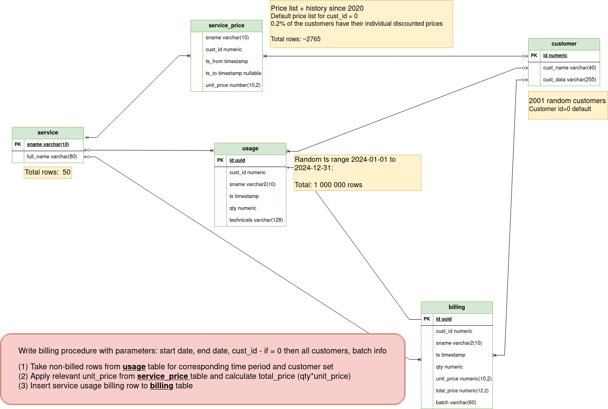

# Performance exercises

Questions and answers: Piotr Kolodziej, EDB (piotr.kolodziej@enterprisedb.com)

## Table of contents

- [1 Before we begin](#1-before-we-begin)
- [2 Exercise #1 - "simple" performance misbehavior](#2-exercise-1---simple-performance-misbehavior)
- [3 Exercise #2 - batch process exercise](#3-exercise-2---batch-process-exercise)

---

## (1) Before we begin

The scripts are intended to be run from `$HOME/postgres_workshop/exercises/` directory (HOME variable is HOME of postgres Linux user). 

Please make sure that the files have the appropriate permissions after unpacking or `git clone`:

```bash
# As postgres user logged to lab machine
cd $HOME/postgres_workshop/
ln -s excersises exersises     # fix misspelled directory name
cd exercises
chmod 0600 *
chmod 0700 *.sh
```

<b></u>Note:</u> All the exercises scripts are intended to be run from `$HOME/postgres_workshop/exercises` directory</b>

As Postgres admin, please run script `00-setup.sql` to set up the `dev01` database and create the `u1` role:

```bash
psql -f 00-setup.sql
```

The configuration file `env-u1.sh` contains the connection information necessary to connect as `u1` to the `dev01` database. It assumes `PGHOST=127.0.0.1`. Please change it if your target Postgres server runs elsewhere.

Verify you can connect to the `dev01` Postgres database as `u1` by running:

```bash
./u1-psql.sh
```

<b>Important remark for the training!!!</b>

It might happen, that `pg_stat_statements` library is not configured in `shared_preload_libraries` Postgres settings. We need to add it to complete successfully Step 7 in Exercise 1.

In the lab machine please do the following:

```bash
cd /opt/postgres/data
cp postgresql.conf postgresql.conf.backup
vi postgresql.conf
## OR nano postgresql.conf  ## if you don't like vi
```

Find and edit `shared_preload_libraries` parameter, uncomment it and edit as below:
```
shared_preload_libraries = 'pg_stat_statements'
```

After saving this change to `postgresql.conf` file, please stop and start Postgres database:

```bash
cd /var/lib/postgresql
pg_ctl -D /opt/postgres/data stop
pg_ctl -D /opt/postgres/data -l logfile start
cd $HOME/postgres_workshop/exercises               # come back to the exercises dir
```

Verify that the parameter is effective from psql after database server restart:

```sql
SHOW shared_preload_libraries;
```

Any script or program below is run under `u1` Postgres user in `dev01` database.
Any time you would like to connect to this database with `u1` role, please invoke the script
```bash
./u1-psql.sh
```
in the cd `$HOME/postgres_workshop/exercises` directory.

[Back to Table of contents](#table-of-contents)

---

## (2) Exercise #1 - "simple" performance misbehavior

The intro story (based on a real case):

> You need to remediate a performance regression in production. Over time, a simple indexed query in the Java application has started taking longer than 4 seconds by default - noticed by the users, application retries and Postgres log. 

<b>The query is very simple like below:</b>
 
```sql
SELECT *
   FROM s1.tst_bind_bigint
  WHERE ext_id = ?;
```
<b>The table definition:</b>

```sql
\d+ s1.tst_bind_bigint
                                       Table "s1.tst_bind_bigint"
 Column  |  Type   | Nullable | Storage  
---------+---------+----------+----------
 id      | bigint  | not null | plain    
 ext_id  | bigint  | not null | plain    
 info    | text    | not null | extended 

Indexes:
  "tst_bind_bigint_pk" PRIMARY KEY btree (id)
  "tst_bind_bigint_i1"         btree (ext_id)
``` 

What could go wrong?

### Step 1
Create the schema and load a small portion of the data, see: [01-create-schema.sql](01-create-schema.sql)

```bash
./01-create-schema.sh
```

[Back to Exercise #1](#2-exercise-1---simple-performance-misbehavior)

### Step 2
Review the application test-case code `TableAccess.java` (see: [TableAccess.java](TableAccess.java)) and run:

```bash
./02-app-behavior.sh
# this invokes: java TableAccess 12345
```

**Questions:**
- What is the execution time?
- Is this normal according to the experience? If not, why?

[Back to Exercise #1](#2-exercise-1---simple-performance-misbehavior)

### Step 3
Compare with the execution in `psql`, see [03-query-psql.sql](03-query-psql.sql):

```bash
./03-query-psql.sh
## runs: SELECT * FROM s1.tst_bind_bigint WHERE ext_id = 12345;
```

**Question:** 
- What are the differences and what could be the reasons?


[Back to Exercise #1](#2-exercise-1---simple-performance-misbehavior)

### Step 4
Prime the cache with a different value and then test again - see: [04-query-psql.sql](04-query-psql.sql):

```bash
./04-query-psql.sh  
# uses ext_id = 44213
```

[Back to Exercise #1](#2-exercise-1---simple-performance-misbehavior)

### Step 5
Run the application for the same new key:

```bash
./05-app-behavior.sh  
# invokes: java TableAccess 44213
```

**Questions:**
- Any difference?
- What conclusions or hypotheses arise?

[Back to Exercise #1](#2-exercise-1---simple-performance-misbehavior)

### Step 6
Capture the execution plan in `psql` - see [06-explain-analyze.sql](06-explain-analyze.sql):

```bash
./06-explain-analyze.sh
```

**Questions:**
- What plan is used?
- Does it use the index?
- Any progress with explanations and remediations?

[Back to Exercise #1](#2-exercise-1---simple-performance-misbehavior)

### Step 7
Inspect `pg_stat_statements` for query stats - see [07-pg-stat-statements.sql](07-pg-stat-statements.sql):

```bash
./07-pg-stat-statements.sh
```

**Questions:**
- What stands out?
- Is the application’s query using the index?
- How does the Java bind variable map to Postgres type? See [TableAccess.java](TableAccess.java) again?

[Back to Exercise #1](#2-exercise-1---simple-performance-misbehavior)

### Step 8
Reproduce in psql with the application’s bind-variable type - see [08-gotit-explain-analyze.sql](08-gotit-explain-analyze.sql):

```bash
./08-gotit-explain-analyze.sh
```

**Question:** How does the planner behave now?

[Back to Exercise #1](#2-exercise-1---simple-performance-misbehavior)

### Step 9
Demonstrate the fix in application code (`ExplainTableBigInt.java`) - see [ExplainTableBigInt.java](ExplainTableBigInt.java):

```bash
./09-difference.sh
```

[Back to Exercise #1](#2-exercise-1---simple-performance-misbehavior)

### Step 10
If you can’t fix the app quickly, add a functional index - see: [10-hotfix-function-index.sql](10-hotfix-function-index.sql):

```bash
./10-hotfix-function-index.sh
```

[Back to Exercise #1](#2-exercise-1---simple-performance-misbehavior)

### Step 11
Re-verify:

```bash
./02-app-behavior.sh
./07-pg-stat-statements.sh
./09-difference.sh
```

[Back to Table of contents](#table-of-contents)

---

## (3) Exercise #2 - batch process exercise

There is a simple application data model:
<p></p>

We will pre-load the data for `tst.service`, `tst.service_price`, `tst.customer` and `tst.usage` tables in the Step 1.
The tables `tst.usage` and `tst.billing` are range partitioned with range partions and the partitioning key is `ts` column which stands for the usage event date. These are monthly partitions for calendar year 2024.

[Back to Exercise #2](#3-exercise-2---batch-process-exercise)

### Step 1
We will set-up `tst` schema and run data load. See SQL file: [30-create-schema.sql](30-create-schema.sql)

**Questions:**
- How the creation of the partitions is handled?
- How the precision of partition end timestamp is handled?

Run the creation script:
```bash
./30-create-schema.sh
```

After it, please verify the objects by using psql command connecting to `dev01` database as `u1` user:
```bash
./u1-psql.sh
```

Tables:

```sql
dev01=> \dt tst.*
                  List of relations
 Schema |      Name       |       Type        | Owner 
--------+-----------------+-------------------+-------
 tst    | billing         | partitioned table | u1
 tst    | billing_2024_01 | table             | u1
 tst    | billing_2024_02 | table             | u1
 tst    | billing_2024_03 | table             | u1
 tst    | billing_2024_04 | table             | u1
 tst    | billing_2024_05 | table             | u1
 tst    | billing_2024_06 | table             | u1
 tst    | billing_2024_07 | table             | u1
 tst    | billing_2024_08 | table             | u1
 tst    | billing_2024_09 | table             | u1
 tst    | billing_2024_10 | table             | u1
 tst    | billing_2024_11 | table             | u1
 tst    | billing_2024_12 | table             | u1
 tst    | customer        | table             | u1
 tst    | service         | table             | u1
 tst    | service_price   | table             | u1
 tst    | usage           | partitioned table | u1
 tst    | usage_2024_01   | table             | u1
 tst    | usage_2024_02   | table             | u1
 tst    | usage_2024_03   | table             | u1
 tst    | usage_2024_04   | table             | u1
 tst    | usage_2024_05   | table             | u1
 tst    | usage_2024_06   | table             | u1
 tst    | usage_2024_07   | table             | u1
 tst    | usage_2024_08   | table             | u1
 tst    | usage_2024_09   | table             | u1
 tst    | usage_2024_10   | table             | u1
 tst    | usage_2024_11   | table             | u1
 tst    | usage_2024_12   | table             | u1
(29 rows)
```

Indexes:
```sql
dev01=> \di tst.*
                                  List of relations
 Schema |             Name              |       Type        | Owner |      Table      
--------+-------------------------------+-------------------+-------+-----------------
 tst    | billing_2024_01_customer_fk_i | index             | u1    | billing_2024_01
 tst    | billing_2024_01_pkey          | index             | u1    | billing_2024_01
 tst    | billing_2024_01_service_fk_i  | index             | u1    | billing_2024_01
 tst    | billing_2024_02_customer_fk_i | index             | u1    | billing_2024_02
 tst    | billing_2024_02_pkey          | index             | u1    | billing_2024_02
 tst    | billing_2024_02_service_fk_i  | index             | u1    | billing_2024_02
 tst    | billing_2024_03_customer_fk_i | index             | u1    | billing_2024_03
 tst    | billing_2024_03_pkey          | index             | u1    | billing_2024_03
 tst    | billing_2024_03_service_fk_i  | index             | u1    | billing_2024_03
 tst    | billing_2024_04_customer_fk_i | index             | u1    | billing_2024_04
 tst    | billing_2024_04_pkey          | index             | u1    | billing_2024_04
 tst    | billing_2024_04_service_fk_i  | index             | u1    | billing_2024_04
 tst    | billing_2024_05_customer_fk_i | index             | u1    | billing_2024_05
 tst    | billing_2024_05_pkey          | index             | u1    | billing_2024_05
 tst    | billing_2024_05_service_fk_i  | index             | u1    | billing_2024_05
 tst    | billing_2024_06_customer_fk_i | index             | u1    | billing_2024_06
 tst    | billing_2024_06_pkey          | index             | u1    | billing_2024_06
 tst    | billing_2024_06_service_fk_i  | index             | u1    | billing_2024_06
 tst    | billing_2024_07_customer_fk_i | index             | u1    | billing_2024_07
 tst    | billing_2024_07_pkey          | index             | u1    | billing_2024_07
 tst    | billing_2024_07_service_fk_i  | index             | u1    | billing_2024_07
 tst    | billing_2024_08_customer_fk_i | index             | u1    | billing_2024_08
 tst    | billing_2024_08_pkey          | index             | u1    | billing_2024_08
 tst    | billing_2024_08_service_fk_i  | index             | u1    | billing_2024_08
 tst    | billing_2024_09_customer_fk_i | index             | u1    | billing_2024_09
 tst    | billing_2024_09_pkey          | index             | u1    | billing_2024_09
 tst    | billing_2024_09_service_fk_i  | index             | u1    | billing_2024_09
 tst    | billing_2024_10_customer_fk_i | index             | u1    | billing_2024_10
 tst    | billing_2024_10_pkey          | index             | u1    | billing_2024_10
 tst    | billing_2024_10_service_fk_i  | index             | u1    | billing_2024_10
 tst    | billing_2024_11_customer_fk_i | index             | u1    | billing_2024_11
 tst    | billing_2024_11_pkey          | index             | u1    | billing_2024_11
 tst    | billing_2024_11_service_fk_i  | index             | u1    | billing_2024_11
 tst    | billing_2024_12_customer_fk_i | index             | u1    | billing_2024_12
 tst    | billing_2024_12_pkey          | index             | u1    | billing_2024_12
 tst    | billing_2024_12_service_fk_i  | index             | u1    | billing_2024_12
 tst    | billing_pk                    | partitioned index | u1    | billing
 tst    | customer_cust_name_key        | index             | u1    | customer
 tst    | customer_pkey                 | index             | u1    | customer
 tst    | service_full_name_key         | index             | u1    | service
 tst    | service_pkey                  | index             | u1    | service
 tst    | service_price_customer_fk_i   | index             | u1    | service_price
 tst    | service_price_i1              | index             | u1    | service_price
 tst    | service_price_service_fk_i    | index             | u1    | service_price
 tst    | usage_2024_01_customer_fk_i   | index             | u1    | usage_2024_01
 tst    | usage_2024_01_pkey            | index             | u1    | usage_2024_01
 tst    | usage_2024_01_service_fk_i    | index             | u1    | usage_2024_01
 tst    | usage_2024_02_customer_fk_i   | index             | u1    | usage_2024_02
 tst    | usage_2024_02_pkey            | index             | u1    | usage_2024_02
 tst    | usage_2024_02_service_fk_i    | index             | u1    | usage_2024_02
 tst    | usage_2024_03_customer_fk_i   | index             | u1    | usage_2024_03
 tst    | usage_2024_03_pkey            | index             | u1    | usage_2024_03
 tst    | usage_2024_03_service_fk_i    | index             | u1    | usage_2024_03
 tst    | usage_2024_04_customer_fk_i   | index             | u1    | usage_2024_04
 tst    | usage_2024_04_pkey            | index             | u1    | usage_2024_04
 tst    | usage_2024_04_service_fk_i    | index             | u1    | usage_2024_04
 tst    | usage_2024_05_customer_fk_i   | index             | u1    | usage_2024_05
 tst    | usage_2024_05_pkey            | index             | u1    | usage_2024_05
 tst    | usage_2024_05_service_fk_i    | index             | u1    | usage_2024_05
 tst    | usage_2024_06_customer_fk_i   | index             | u1    | usage_2024_06
 tst    | usage_2024_06_pkey            | index             | u1    | usage_2024_06
 tst    | usage_2024_06_service_fk_i    | index             | u1    | usage_2024_06
 tst    | usage_2024_07_customer_fk_i   | index             | u1    | usage_2024_07
 tst    | usage_2024_07_pkey            | index             | u1    | usage_2024_07
 tst    | usage_2024_07_service_fk_i    | index             | u1    | usage_2024_07
 tst    | usage_2024_08_customer_fk_i   | index             | u1    | usage_2024_08
 tst    | usage_2024_08_pkey            | index             | u1    | usage_2024_08
 tst    | usage_2024_08_service_fk_i    | index             | u1    | usage_2024_08
 tst    | usage_2024_09_customer_fk_i   | index             | u1    | usage_2024_09
 tst    | usage_2024_09_pkey            | index             | u1    | usage_2024_09
 tst    | usage_2024_09_service_fk_i    | index             | u1    | usage_2024_09
 tst    | usage_2024_10_customer_fk_i   | index             | u1    | usage_2024_10
 tst    | usage_2024_10_pkey            | index             | u1    | usage_2024_10
 tst    | usage_2024_10_service_fk_i    | index             | u1    | usage_2024_10
 tst    | usage_2024_11_customer_fk_i   | index             | u1    | usage_2024_11
 tst    | usage_2024_11_pkey            | index             | u1    | usage_2024_11
 tst    | usage_2024_11_service_fk_i    | index             | u1    | usage_2024_11
 tst    | usage_2024_12_customer_fk_i   | index             | u1    | usage_2024_12
 tst    | usage_2024_12_pkey            | index             | u1    | usage_2024_12
 tst    | usage_2024_12_service_fk_i    | index             | u1    | usage_2024_12
 tst    | usage_pk                      | partitioned index | u1    | usage
(81 rows)
```

Record count:
```sql
dev01=> select count(*) from tst.service;
 count 
-------
    50
(1 row)

dev01=> select count(*) from tst.service_price;
 count 
-------
  2490
(1 row)

dev01=> select count(*) from tst.customer;
 count 
-------
  2001
(1 row)

dev01=> select count(*) from tst.usage;
  count  
---------
 1000000
(1 row)
```

[Back to Exercise #2](#3-exercise-2---batch-process-exercise)

### Step 2
Let's try the first implementation. See SQL file: [31-create-proc-billing.sql](31-create-proc-billing.sql)

For every row in usage that is not billed, we select the appropriate unit price in `tst.service_price`. It is a very classic way of implementation.

Let's create the procedure `tst.proc_billing` by running the script:
```bash
./31-create-proc-billing.sh
```

[Back to Exercise #2](#3-exercise-2---batch-process-exercise)

### Step 3
Once we run the `31-create-proc-billing.sh` script and `tst.proc_billing` procedure is created, let's run the whole year billing by calling it `call tst.proc_billing (date '2024-01-01', date '2024-12-31', 0);`

The script `32-exec-proc-billing.sh` truncates `tst.billing` table, sets the \timing on` and calls the procedure - see: [32-exec-proc-billing.sql](32-exec-proc-billing.sql)

```bash
./32-exec-proc-billing.sh
```

**Questions:**
- What is its execution time? Please write it down.
- How can it be improved?

[Back to Exercise #2](#3-exercise-2---batch-process-exercise)

### Step 4

We might have many concepts. Let's create the procedure `tst.proc_billing0`, that just reads the unbilled `tst.usage` rows and uses an artificially constant unit price (skipping lookups to `tst.service_price`). It will indicate us some performance limits.
See: [33-create-proc-null-billing.sql](33-create-proc-null-billing.sql)

```bash
./33-create-proc-null-billing.sh
```

[Back to Exercise #2](#3-exercise-2---batch-process-exercise)

### Step 5

Let's run `tst.proc_billing0` - we'll see what is the impact of the look-ups to service unit prices by comparing this execution time with the time got in Step 3. The SQL script is [34-exec-proc-null-billing.sql](34-exec-proc-null-billing.sql)

```bash
./34-exec-proc-null-billing.sh
```

[Back to Exercise #2](#3-exercise-2---batch-process-exercise)

**Questions:**
- What is its execution time? Please write it down and compare with the execution time from Step 3.
- What are the potential conclusions?

### Step 6

One of the ways to optimize the calls to look-up values is to store their values in the memory of the procedure.
It is especially usefull for relatively small but very frequently accessed data sets. The configuration data, relat- ively static reference data sets like `tst.service_price` are some of the examples.

We tried to reimplement the billing procedure to keep the relevant portion of `tst.service_price` table transformed to the in-memory format using the `HSTORE` variable. It is a hash table where the key will be derived from sname (service name) and cust_id. Please note, some customers may have their own pricing, if they do not have the pricing for cust_id=0 (DEFAULT) will be applied.

The limitation of the model is the fact, that for matching cust_id we'll need to perform (linear) search through the pricing changes. In other words - longer period we process in billing, more pricing changes we had, less improvement we may get.

See: [35-create-proc-opt1.sql](35-create-proc-opt1.sql)

Let's create the other implementation of the billing procedure with the name of `tst.proc_billing4_1`

```bash
./35-create-proc-opt1.sh
```
[Back to Exercise #2](#3-exercise-2---batch-process-exercise)

### Step 7

Let's run `tst.proc_billing4_1`, using cached portion of the data from `tst.service` in `hstore` type procedure variable.
We'll see what is the difference of the execution time compared to the result achieved in Step 3. The SQL script is [36-exec-proc-billing-opt1.sql](36-exec-proc-billing-opt1.sql)

```bash
./36-exec-proc-billing-opt1.sh
```

**Questions:**
- What is its execution time? Please write it down and compare with the execution time from Step 3.
- What are the potential conclusions?

[Back to Exercise #2](#3-exercise-2---batch-process-exercise)

### Step 8

We tried to reimplement the billing procedure to keep the relevant portion of `tst.service_price` table transformed to the in-memory format using the JSONB variable addressed by a key derived from sname (service name) and cust_id.
This is possible since Postgres 17.

See: [37-create-proc-opt2.sql](37-create-proc-opt2.sql)

Let's create the other implementation of the billing procedure with the name of `tst.proc_billing5_4`

```bash
./37-create-proc-opt2.sh
```

[Back to Exercise #2](#3-exercise-2---batch-process-exercise)

### Step 9

Let's run `tst.proc_billing5_4`, using cached portion of the data from `tst.service` in JSONB type procedure variable.
We'll see what is the difference of the execution time compared to the result achieved in Step 3 and 7. The SQL script is [38-exec-proc-billing-opt2.sql](38-exec-proc-billing-opt2.sql)

```bash
./38-exec-proc-billing-opt2.sh
```

**Questions:**
- What is its execution time? Please write it down and compare with the execution time from Step 3 and 7.
- What are the potential conclusions?

### Step 10 (optional)

```bash
./42-exec-proc-billing.sh          # similar to ./32-exec-proc-billing.sh, but for Q1 2024 only (not full 2024)
./44-exec-proc-null-billing.sh     # similar to ./34-exec-proc-null-billing.sh, but for Q1 2024 only (not full 2024)
./46-exec-proc-billing-opt1.sh     # similar to ./36-exec-proc-billing-opt1.sh, but for Q1 2024 only (not full 2024)
./48-exec-proc-billing-opt2.sh     # similar to ./48-exec-proc-billing-opt2.sh, but for Q1 2024 only (not full 2024)
```


[Back to Exercise #2](#3-exercise-2---batch-process-exercise)

[Back to Table of contents](#table-of-contents)
